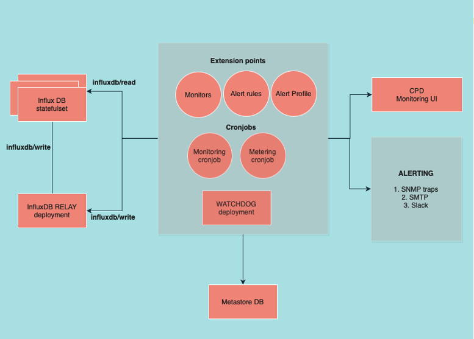

# Monitoring and alerting in Cloud pak for Data

IBM Cloud Pak for Data provides a monitoring and alerting framework that you can use to monitor the state of the platform and set up events to alert based on thresholds.

# Glossary

### Event
An event is the state of an entity such as a pod, persistent volume claim (PVC), or other resource at a certain point in time. 

### Event type
An event type is the type of resource being monitored. It can be a pod, persistent volume claim (PVC) etc. Each event type is associated with an alert type which allows for separate rules to be set for different resources. For example, a PVC critical state would need to be alerted immediately while a pod could have a relaxed rule.

### Severity
Each event is associated with a severity which could be one of Informational, Warning or Critical based on state of the monitored entity. For example, a pod in Running status could emit an Informational Event, while one in Pending status a warning event and critical event for pod which is in failing state.

### Alert
Alerts can be configured to be sent based on the above events. For example, an alert can be set to trigger when a pod indicates 3 consecutive critical events. 
Alerts could also be based on thresholds ( say resource consumption > 75% ). We support SMTP, SNMP(v2) and Slack alert forwarding at this time.

### Monitor
A script that is scheduled to run as part of a cronjob which monitors resources and emits events. These events are persisted in a time series DB which is then monitored by the Watchdog Alert Manager(WAM).

### Alert Type
Rules for alerting. Can be set to trigger in case of warning or critical events.

### Alert Profile
Enable alert forwarding and associated properties. For example, users can set SMTP to true to receive e-mail alerts and also provide intended recipients to receive the alerts.

### Watchdog Alert manager (WAM)
A cronjob that serves 2 purposes -- 
 1. Sets up cronjobs based on *custom monitor extensions*
 2. Monitors events in Influx DB to identify any potential alerts(based on Alert Type) and forwards the alerts based on associated profiles.

# Introduction

Cloud Pak for data installs a *diagnostics* monitor that monitors a few critical resources every 10 mins. These *event types*(resources) being tracked out of the box are as follows:

 1. **Services** - Cumulative status of *Service instances* as well as pods belonging to *services* installed as part of Cloud Pad for data.
 2. **Service Instances** - Tracks status of pods associated with the *service instance*.
 3. **Replicas** - Checks the availability of *replicas* for *deployments* and *statefulsets*.
 4. **Persistent Volume Claim** - Looks for issues surrounding PVCs in instance namespaces.
 5. **Service quota** - Tracks *quota* status of installed *services*.

**WAM**(running every 10 mins) then looks at all the events that have been pushed into *Influx DB* to look specifically for *Critical/Warning* events. It then cross checks those events with associated alerting rules for those *event types* and triggers alerts if needed. 
For example, if the *alert type* for PVC is set to immediate and one of the PVCs were found to be in *critical* state, the **WAM** would trigger alerts as soon as it finds one in *critical* state in Influx DB.

# Custom Monitor

Developers can set up custom monitors using the alerting framework.

As mentioned earlier, Monitors check the state of event types(resources) periodically and generate events that are stored in Influx DB. Administrators might be interested in node resource efficiency, memory quotas, license usage, user management events, and provisioning diagnostics. You can set up custom monitors that track resource usage against your target usage for the platform.

Monitors can be registered into  Cloud Pak for Data  through an extension  configmap. The  configmap  has all the details that are needed to create a cron job, including the details of the script, the image to be used, the schedule for the cron job, and any environment variables. This ensures that the alerting framework has all the necessary information to create a cron job, monitor events frequently, and trigger alerts if and when needed.

# Alert Type

You can enable alerts for critical and warning events and define when to forward a certain alert to the user. You can set the throttle time so users are not spammed with alerts when an event persists. To change the default alerting rules, you must use the Alerting APIs. 

The default alerting rules are set as follows:

-   For critical events, a condition persists for 30 minutes when 3 consecutive  critical  events are recorded during monitor runs. When the condition is alerted, it is snoozed for 12 hours.
-   For warning events, 5 warning events are recorded during the last 20 monitor runs with a snooze period of 24 hours.

| Parameter | Description  |
|--|--|
| **severity** | The severity to be set.   Can be one of the following options:   - *critical*   - *warning*   You can't configure the alert rules for informational alerts |
| **trigger_type** | Determine how to trigger alerts.   Can be one of the following options:   - *immediate*   - *custom*: This custom option is associated with *alert_count* and *alert_over_count*. |
| **alert_count** | Count of events with the severity type for the current resource. |
| **alert_over_count** | Count of total past events for the current resource to be referenced. |
| **snooze_time** | The number of hours to wait before an alert is sent for the current resource. |
| **notify_when_condition_clears** | Determines whether to send an alert when the *critical/warning* condition clears, if a previous alert for the critical/warning condition had been sent earlier. |

# Alert Profile

A default profile is installed when Cloud Pak for Data is installed. Currently, you cannot set up custom alert profiles. Alert forwarding using SMTP, SNMP and Slack is supported. 

## SMTP

Alerts can be sent as email by using SMTP. You can configure a connection to your SMTP server in Administration > Platform configuration.

## SNMP

 Alerts can be sent as traps by using SNMP (simple network management protocol). SNMP is a standard protocol for collecting and organizing information about managed devices or services. It exposes management data in the form of variables that are defined in managed information base (MIB) files.

## Slack 

To enable Slack alerts, an administrator must provide a webhook URL, which can be set up to receive notifications on a channel. When the webhook URL is available, the following information can be provided:
