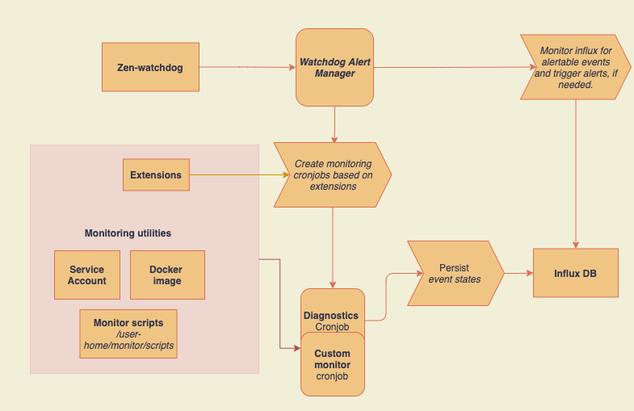

- [Introduction and Purpose](#introduction-and-purpose)
- [Cloud pak for data Monitoring framework concepts](#cloud-pak-for-data-monitoring-framework-concepts)
- [Questions to consider before you look further](#questions-to-consider-before-you-look-further)
- [Introduce custom monitors](#introduce-custom-monitors)
	- [Monitoring script](#monitoring-script)
	- [Build Docker image](#build-docker-image)
	- [Introduce Monitoring extensions](#introduce-monitoring-extensions)


## Introduction and Purpose

The intention behind this repo is to help users understand and enhance the monitoring feature by introducing sample scripts through custom monitors which would in turn help proactively address and alert of any potential issues before they turn critical.

This particular readme focuses on setting up custom monitors. It takes you through the complete process of creating and introducing scripts into Cloud Pak for data instance that can monitor and report/persist state information into a time series DB. The Watchdog Alert manager then looks into these events to decide, in conjunction with associated alerting rules, to trigger alerts if needed. We highly recommend you understand the concepts behind the framework before delving further into the custom monitor tutorial.



## Cloud pak for data Monitoring framework concepts

Please refer to the [following doc](docs/Monitoring.md) for extensive information on Monitoring essentials.

## Questions to consider before you look further

Alright, you've decided to enhance the monitoring framework by introducing custom monitors. Please take a few minutes to understand and help answer the following questions before you jump further.
1. What are event types, alert types and alert profiles?
2. Can you differentiate monitoring scripts with a Monitor?
3. What resource are you planning to track? Does it need extended privileges like cluster roles? If yes, please refer to the Service Account documentation in the docs folder.
4. What about authentication for tracking the resource, eg: Portworx volumes?

## Introduce custom monitors

Developers can set up custom monitors using the alerting framework.

Monitors check the state of entities periodically and generate events that are stored in Metastore database. Administrators might be interested in node resource efficiency, memory quotas, license usage, user management events, and provisioning diagnostics. You can set up custom monitors that track resource usage against your target usage for the platform.

Monitors can be registered into Cloud Pak for Data through an extension configmap. The configmap has all the details that are needed to create a cron job, including the details of the script, the image to be used, the schedule for the cron job, and any environment variables. This ensures that the alerting framework has all the necessary information to create a cron job, monitor events frequently, and trigger alerts if and when needed.


IN PROGRESS:
Document build script that would create the docker file with the included scripts 

### Monitoring script

First step in the process would be to develop a script that helps monitor the resource and send the state of the resource to Influx DB, using a zen-watchdog API.

The following sample script tracks persistent volume claims and reports events based on the status. If a PVC is bound, an info is registered for the PVC. If a PVC is in an unbound or failed state, a critical event is recorded. This monitor is based on Python 3.7 and uses the Kubernetes Python SDK to interact with the cluster.

The following script uses the in-cluster config to authenticate to Kubernetes and access the resources. 

```
By default, all setups allow access to the following volumes:

 1. User-home-pvc - location for the scripts under `/user-home/monitoring/scripts`
 2. Zen-service-broker-secret - Auth against the zen-watchdog API for sending resource events.
 
The following environment variables are also made available as part of the cron job initialization:

ICPD_CONTROLPLANE_NAMESPACE - The control plane namespace.
```

The following Python script lists PVCs and generates events based on their state. All non-bound PVCs are recorded with critical severity. The events are sent as a JSON array to the POST events endpoint, authorized with the service broker token.

```python
import os 
import requests 
import json from kubernetes 
import client, config, watch 
def main(): 
# setup the namespace 
	ns = os.environ.get('ICPD_CONTROLPLANE_NAMESPACE') 
if ns is None: 
	ns = "" 
monitor_type = "sample-monitor" 
event_type = "check-pvc-status" 
# configure client 
config.load_incluster_config() 
api = client.CoreV1Api() 

# configure post request and  set secret headers 
url = 'https://zen-watchdog-svc:4444/zen-watchdog/v1/monitoring/events' 
with open('/var/run/sharedsecrets/token', 'r') as file: 
	secret_header = file.read().replace('\n', '') 
headers = {'Content-type': 'application/json', 'secret': secret_header} 

# Print PVC list, set status as critical for unbound or failed pvc 
pvcs = api.list_namespaced_persistent_volume_claim(namespace=ns, watch=False) 
events = [] 
for pvc in pvcs.items: 
	severity = "info"  
	print(pvc.status.phase) 
	if pvc.status.phase != 'Bound': 
		severity = "critical" 
	#The metadata field needs to be in <key1:value1,key2:vaue2> format to be easily absorbed for prometheus consumption.
	#The keys(key1,key2) is also referenced as part of the property "long_description" in alert monitor extension to be available for viewing in the UI. Please refer to the 
	metadata = "Avaialble=10,Unavailable=5"  
	data = {"monitor_type":monitor_type, "event_type":event_type, "severity":severity, "metadata":metadata, "reference":pvc.metadata.name} 
	events.append(data) 
json_string = json.dumps(events) 
# post call to zen-watchdog to record events 
r = requests.post(url, headers=headers, data=json_string, verify=False) 
print(r.status_code) 
if __name__ == '__main__': 
main()
```

This and all other scripts would need to be part of the `scripts` folder before you start building the docker image.

### Build Docker image

This step involves creating docker image which includes the monitoring scripts localted under the `scripts` folder and also contains the corresponding utils needed to run the scripts.

The dockerfile is located under the `build` folder. It's job is to ensure the following -

1. Ensure all scripts are uploaded to the `user-home/monitoring/scripts` folder
2. Introduce python and all required packages listed in the `requirements.txt` file
3. Run the `run_scripts.sh` file on startup. 

To build the docker image, run the following command from inside the `build` directory.
`docker build .`

This would create the docker ifle 

Once the docker image is ready, it's time to upload it to the registry. The steps to ensure that are as follows:

1. Docker login to the registry
`docker login <docker-registry>`
2. Tag the image 
docker tag <image-digest> <>
3. Push the image 

### Introduce Monitoring extensions

This is the final step in the process. Here we upload the required monitor, alert type and profile extensions that would form the basis of the custom monitor. 

IN PROGRESS: a script that installs the extensions into the CPD instance. The Watchdog alert manager(WAM) would then read the extensions and create a cronjob that uses the above docker image to monitor and report resource status to Influx DB.